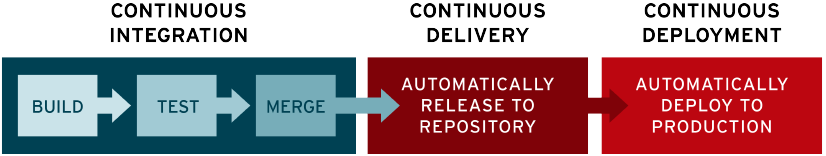
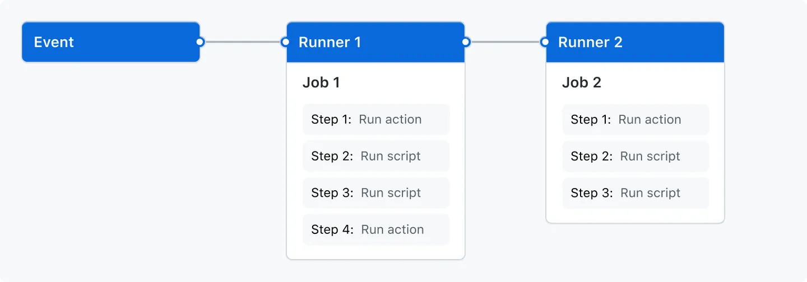

- [x] 컨테이너 개념을 학습합니다. 컨테이너 서비스는 `docker` 를 사용합니다.
- [ ] `Github Actions` 를 이용해 PR 등에 대해 Trigger 되는 CI/CD 환경을 구축합니다.
	- [x] Lint 체크
	- [x] Coverage 리포트, Test 체크
	- [ ] phase 별로 서로 다른 파이프라인을 생성해보세요.
- [ ] `docker-compose` 를 이용해 서버와 DB 를 이미지로 생성합니다.
	- [ ] phase 별로 다른 명세가 필요할 수 있습니다.
--- 
# Docker
https://docs.docker.com/get-started/overview/

- Docker는 애플리케이션을 개발, 제공 및 실행하기 위해 도커는 **컨테이너 기술을 기반으로 한 일종의 가상화 플랫폼**
	- **실행환경을 컨테이너로 추상화**
- Docker를 사용하면 애플리케이션을 인프라에서 분리하여 소프트웨어를 신속하게 제공
- Docker를 사용하면 애플리케이션을 관리하는 것과 동일한 방식으로 인프라를 관리할 수 있다.
- 코드 전달, 테스트 및 배포를 위한 Docker의 방법론을 활용하면 코드 작성과 프로덕션 환경 실행 사이의 지연 시간을 크게 줄일 수 있다.
#### Images
- 컨테이너 실행에 필요한 파일과 설정 값 등을 포함하고 있는 것
- 이미지는 Docker 컨테이너를 생성하기 위한 지침이 포함된 읽기 전용 템플릿
#### Containers
- 컨테이너는 **격리된 공간에서 프로세스가 동작하는 기술**(프로세스 격리)
- 컨테이너는 실행 가능한 이미지 인스턴스. Docker API 또는 CLI를 사용하여 컨테이너를 생성, 시작, 중지, 이동 또는 삭제할 수 있다.

### Docker Compose
https://docs.docker.com/compose/
- Docker Compose는 다중 컨테이너 애플리케이션을 정의하고 공유하는 데 도움이 되는 도구. Compose를 사용하면 YAML 파일을 생성하여 서비스를 정의할 수 있으며 단일 명령으로 모든 것을 가동하거나 해체할 수 있다.
- Compose는 다중 컨테이너 Docker 애플리케이션을 정의하고 실행하기 위한 도구
- Compose에서는 YAML 파일을 사용하여 애플리케이션 서비스를 구성합니다. 그런 다음 단일 명령을 사용하여 구성에서 모든 서비스를 생성하고 시작

# CI/CD
https://www.redhat.com/ko/topics/devops/what-cicd-pipeline

### CI/CD?
- 지속적 통합(Continuous Integration, CI)
	- "CI"는 개발자를 위한 자동화 프로세스인 지속적인 통합(Continuous Integration)을 의미
	- 지속적인 통합이 제대로 구현되면 애플리케이션 코드의 새로운 변경 사항이 정기적으로 빌드 및 테스트를 거쳐 공유 리포지토리에 병합된다.
- 지속적 제공(Continuous Delivery, CD)
	- 지속적인 제공이란 개발자들이 애플리케이션에 적용한 변경 사항이 버그 테스트를 거쳐 리포지토리(예: GitHub 또는 컨테이너 레지스트리)에 자동으로 업로드되는 것을 뜻한다.
- 지속적 배포(Continuous Deployment, CD)
	- 지속적인 배포(또 다른 의미의 "CD": Continuous Deployment)란 개발자의 변경 사항을 리포지토리에서 고객이 사용 가능한 프로덕션 환경까지 자동으로 릴리스하는 것을 의미

# GitHub Actions
https://docs.github.com/en/actions/learn-github-actions/understanding-github-actions
- GitHub Actions는 빌드, 테스트 및 배포 파이프라인을 자동화할 수 있는 CI/CD(지속적 통합 및 지속적 전달) 플랫폼

### The components of GitHub Actions

- Events
	- 이벤트는 워크플로우 실행을 트리거하는 저장소의 특정 활동 
	- pushes a commit to a repository, pull reques, opens an issue...
- Workflows
	- 워크플로우는 하나 이상의 Job을 실행하는 구성 가능한 자동화된 프로세스
- Jobs
	- Job은 동일한 Runner에서 실행되는 워크플로우의 step의 집합
- step
	- 각 step은 실행될 셸 스크립트 또는 action
- action
	- 액션은 복잡하지만 자주 반복되는 작업을 수행하는 GitHub 액션 플랫폼용 사용자 지정 애플리케이션
	- 액션은 GitHub에서 Git 리포지토리를 가져오거나, 빌드 환경에 맞는 올바른 도구 체인을 설정하거나, 클라우드 제공업체에 대한 인증을 설정할 수 있다.
- Runners 
	- 러너는 워크플로우가 트리거될 때 워크플로우를 실행하는 서버
	- 각각의 Job은 개별의 Runner에서 실행
---
# Workflow
## build-and-deploy.yml
```yaml
name: build-and-deploy  
  
on:  
  push:  
    branches: [ "main" ]  
  pull_request:  
    branches: [ "main" ]  
  
env:  
  AWS_REGION: ap-northeast-2  
  ECR_REPOSITORY: test  
  ECS_SERVICE: test-service  
  ECS_CLUSTER: test-cluster  
  ECS_TASK_DEFINITION: test-task.json  
  CONTAINER_NAME: app  
  
jobs:  
  build:  
    runs-on: ubuntu-latest  
  
    steps:  
      - uses: actions/checkout@v3  
  
      - name: Set up JDK 17  
        uses: actions/setup-java@v3  
        with:  
          java-version: '17'  
          distribution: 'temurin'  
  
      - name: Cache SonarCloud packages  
        uses: actions/cache@v3.3.2  
        with:  
          path: ~/.sonar/cache  
          key: ${{ runner.os }}-sonar  
          restore-keys: ${{ runner.os }}-sonar  
  
      - name: Cache Gradle packages  
        uses: actions/cache@v3.3.2  
        with:  
          path: ~/.gradle/caches  
          key: ${{ runner.os }}-gradle-${{ hashFiles('**/*.gradle') }}  
          restore-keys: ${{ runner.os }}-gradle  
  
      - name: Build and analyze  
        env:  
          GITHUB_TOKEN: ${{ secrets.GITHUB_TOKEN }}  
          SONAR_TOKEN: ${{ secrets.SONAR_TOKEN }}  
        run: ./gradlew build jacocoTestReport sonar --info  
      - uses: actions/upload-artifact@v3.1.3  
        with:  
          path: build/libs/*.jar  
  
      - name: Configure AWS credentials  
        uses: aws-actions/configure-aws-credentials@v2  
        with:  
          aws-access-key-id: ${{ secrets.AWS_ACCESS_KEY_ID }}  
          aws-secret-access-key: ${{ secrets.AWS_SECRET_ACCESS_KEY }}  
          aws-region: ${{ env.AWS_REGION }}  
  
      - name: Login to Amazon ECR  
        id: login-ecr  
        uses: aws-actions/amazon-ecr-login@v1  
        with:  
          mask-password: 'true'  
  
      - name: Build, tag, and push docker image to Amazon ECR  
        id: build-image  
        env:  
          ECR_REGISTRY: ${{ steps.login-ecr.outputs.registry }}  
          IMAGE_TAG: latest  
        run: |  
          docker build -t $ECR_REGISTRY/$ECR_REPOSITORY:$IMAGE_TAG .  
          docker push $ECR_REGISTRY/$ECR_REPOSITORY:$IMAGE_TAG  
          echo "image=$ECR_REGISTRY/$ECR_REPOSITORY:$IMAGE_TAG" >> $GITHUB_OUTPUT  
  
      - name: Fill in the new image ID in the Amazon ECS task definition  
        id: task-def  
        uses: aws-actions/amazon-ecs-render-task-definition@v1  
        with:  
          task-definition: ${{ env.ECS_TASK_DEFINITION }}  
          container-name: ${{ env.CONTAINER_NAME }}  
          image: ${{ steps.build-image.outputs.image }}  
  
      - name: Deploy Amazon ECS task definition  
        uses: aws-actions/amazon-ecs-deploy-task-definition@v1  
        with:  
          task-definition: ${{ steps.task-def.outputs.task-definition }}  
          service: ${{ env.ECS_SERVICE }}  
          cluster: ${{ env.ECS_CLUSTER }}  
          wait-for-service-stability: true
```
- https://docs.github.com/en/actions/deployment/deploying-to-your-cloud-provider/deploying-to-amazon-elastic-container-service
- https://github.com/mikepenz/action-junit-report
- 

