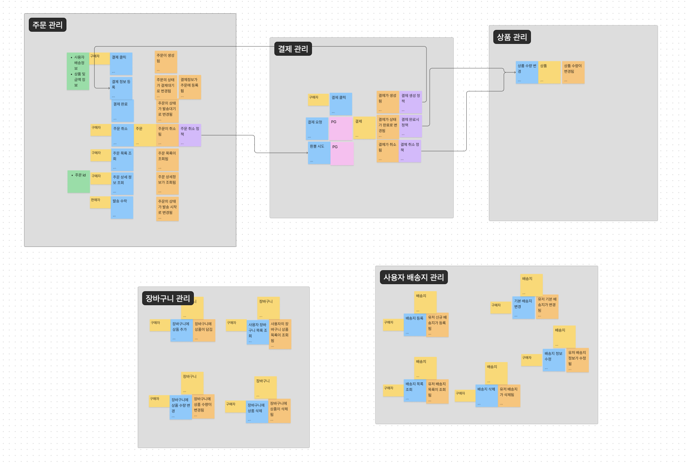

# 오프라인 발제 및 기술 나눔
## 토요 지식회
### 소프트 스킬
#### 롱런하는 개발자 마인드셋
> 항상 스스로에게 가혹한 우리가 개발자로서 성장하기 위해 갖추어야 할 것은 무엇일까?
- 왜?를 항상 생각하는 개발자
### 하드 스킬
#### 컴퓨팅 리소스 부족
> 한시적으로 이벤트를 개최하였더니 트래픽이 급증하였다. 이 때, DB의 리소스 이용률 또한 높아 서버 및 DB에 많은 부하를 주기 시작하였는데 이 상황을 각각 어떻게 극복하는 것이 좋을까?
- CQRS
- DB 스케일 아웃
#### 조인문제
> FK 에 의한 조인은 특정 케이스에서는 더 많은 부하를 일으키는 등 문제가 발생하는데, 어떤 경우에서 문제가 발생할 수 있을까? 또 FK 를 안쓰면 어떻게 우리가 다양한 데이터의 연관관계를 제어할 수 있을까?
- 라이프사이클이 같은 객체들만 연관관계 매핑
- JPA의 경우 Aggregate Root 활용
#### 락 및 데드락
> 다양한 서버가 동시에 같은 DB 를 바라보고 작업하게 될텐데, 이 때 데이터의 동시성 문제는 어떻게 지켜질 수 있을까?
- 분산락
---
# Chapter 2
## 테스트 케이스

### 단위테스트
#### 상품
- ~~상품의 수량은 0미만이 될 수 없다~~.
- 구매수량이 상품의 수량보다 많을 수 없다.
#### 배송
- 배송객체를 생성한다.
#### 결제
- 결제를 생성한다.
- 결제의 상태를 변경한다.
#### 장바구니
- 장바구니를 생성한다.
- 장바구니에 똑같은 상품이 추가 된다면 장바구니의 수량이 늘어난다.
#### 주문
- 주문을 생성한다.
- 주문의 상태가 결제대기, 발송대기 상태만 취소 처리로 변경이 가능하다.
#### 즐겨찾기
- 즐겨찾기를 생성한다.
- 상품 추가시 동일한 상품을 추가할 수 없다.
#### 사용자
- 
### 통합 테스트
#### 상품
- 상품을 생성한다.
	- 상품의 수량은 1이상이여야 한다.
- 상품을 조회한다.
	- 올바른 상품의 id이여야한다.
	- 
#### 배송
- 
#### 결제
- 
####  장바구니
- 상품을 바로 주문할 경우에도 해당 상품을 장바구니에 추가한다.
- 사용자가 처음 상품을 추가할 때 장바구니를 생성한다.
- 존재하지 않는 상품은 장바구니에 추가 할 수 없다.
- 장바구니의 상품이 주문, 결제됐을 경우 주문된 상품들은 수량을 줄이거나 삭제한다.
#### 주문
- 올바른 상품만 주문할 수 있다.
- 주문이 발송 대기 상태로 변경되기 위해서는 배송정보와 완료상태인 결재가 필요하다.
#### 즐겨찾기 
- 
#### 사용자
- 
---
### 테스트 시나리오
#### 주문
- 주문을 생성한다.
	- 사용자(User) 정보 검증
		- 사용자 정보가 잘못 되었을 경우
	- 주문된 품목(OrderedVariant) 정보 검증
		- 기본(OrderedVariant) 정보 검증
			- 금액, 상품명
			- 주문 수량이 0이하인 경우
		- 상품(Product) 정보 검증
			- 상품 정보가 잘못 되었을 경우
		- 상품(ProductOption) 옵션 검증
			- 상품의 옵션이 잘못 되었을 경우
		- 품목(Variant) 수량 검증
			- 주문 품목이 비어있는 경우
			- 품목의 수량이 0이하인 경우
	- 기본(Order) 정보 검증
		- 배송지
- 주문 상태를 변경한다.
	- 결제 완료로 변경
		- 결제(Payment) 정보 검증
			- 결제 상태가 잘못 되었거나 완료 상태가 아닐 경우
	- 결제 취소로 변경
		- 현재 주문 상태 검증
			- 현재 주문의 상태가 결제 대기, 발송 대기가 아닐 경우
	- 발송 시작으로 변경
		- 
- 주문 목록을 조회한다.
	- 
- 주문을 조회한다.
	- 


```
- 주문의 상태를 배송 완료로 변경하기위해서는 배송에 대한 상태 확인이 필요
```
#### 고객
- 신규 배송지를 등록한다.
	- 사용자 정보 검증
		- 사용자 정보가 잘못 되었을 경우
	- 배송지 정보 검증
		- 수령인, 연락처, 배송지 주소 및 상세주소
- 배송지 정보를 수정한다.
	- 사용자 정보 검증
		- 사용자 정보가 잘못 되었을 경우
	- 배송지 정보 검증
		- 수령인, 연락처, 배송지 주소 및 상세주소, 기존 배송지 유무
- 배송지를 삭제한다.
	- 사용자 정보 검증
		- 사용자 정보가 잘못 되었을 경우
	- 기본 배송지 여부 검증
		- 기본 배송지 여부에 따라 삭제 여부 확인
- 배송지 목록을 조회한다.
- 배송지를 조회한다.

```
- 기본 배송지 삭제에대한 정책
```

---

## 이벤트 스토밍
https://www.figma.com/file/OX8XVKsWjhY2CuL57DuzZQ/voyagers?type=whiteboard&node-id=94%3A501&t=Dq1hBgvJzRoS6nwW-1

