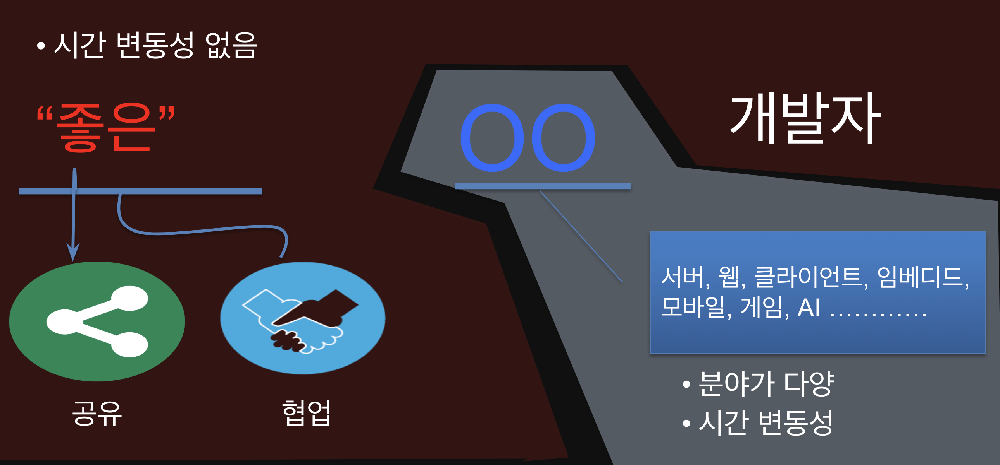

# 특강
## 지속적으로 성장하는 개발자

### 지속적인 성장 방법
- 오버 엔지니어링 X, 적절한 논리력
- 사용하는 코드만 만들기(Caller Create)
- 리팩토링(Refactoring)
- 코드 읽기(Code Review)
### 공유 이유
- 주변이 똑똑해져야 내가 편함
- 좋은 평판을 얻을 수 있음
- 주변의 덕을 볼 확률이 올라감
### 공유 대상
- 실패 경험
- 그냥 공유하는 것은 의미없음
	- 직접 사용하고 장단점이나 사용이유와 같은 점을 공유
### 협업
- 사람에대한 이해가 기본
### 자존감
- 나는 나답게 주도적으로 -> 자존감 필요
	- 밀그램의 복종 실험
	- 찰스 로플링의 간호사 실험
- 통제할 수 있는 영역에 집중
	- 자신의 믿음
	- 자신의 생각
	- 외부에 대한 반응
	- 자신의 업무
	- 업무 도구

> 인간은 합리적이지 않다.
> 인간은 합리적인 존재가 아니라 합리화하는 존재
---
